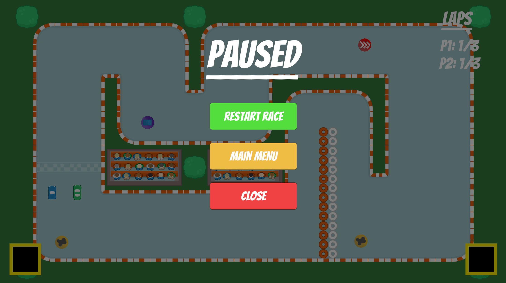

# KarioMart
2D Racing game - School project

---

TO START
- Open project folder with the Unity editor (2022.3.9f1).
- Go into MainMenu scene if not already and press the Start scene button.

---

TO PLAY
- Press the play button in the Main menu.

- In the selection screen select a car for each player and a track to race on.

- Press the "Start race" button to start the race on the selected track. 
  Before the race starts, a counter will show up.

- To pause the game, press the ESC button.

- After the race is finished, a leaderboard will show, and a timer will count down. 
  When the timer reaches 0, you will be returned to the selection screen.

---

Controls for the game can be found in the controls scene of the game.

---

Created by Sean Schelvis 

Sprite Assets by Kenney.nl
Powerup emblems by Mika Schelvis